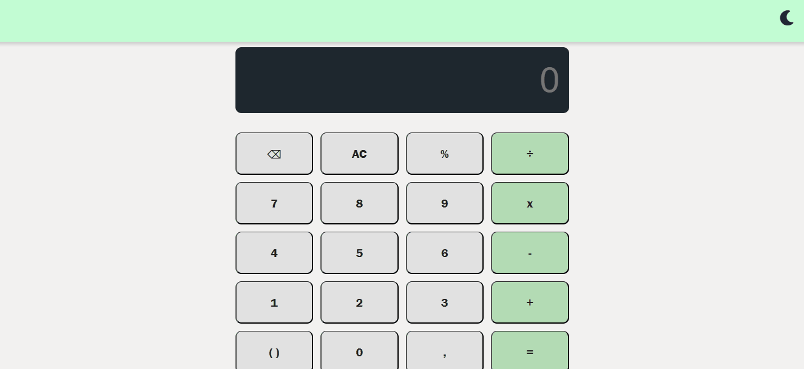

# CALCULADORA PREMIUM
## Design Escandinavo e Café Premium

Uma aplicação web leve desenvolvida em JavaScript Puro (Vanilla JS) e CSS3. Este foi o meu primeiro projeto prático no desenvolvimento de software. Ele reflete o início da minha jornada e a minha evolução técnica até as práticas modernas de arquitetura de código.

---

### DEMONSTRAÇÃO VISUAL

---

### IDENTIDADE VISUAL E TEMAS

O projeto foge dos padrões comuns e traz duas estéticas visuais elegantes:

*   **Tema Claro (Escandinavo)**: Cores neutras, limpas e minimalistas. Elas focam no conforto visual e na simplicidade das formas.
*   **Tema Escuro (Café Premium)**: Tons ricos e profundos inspirados na cultura do café. Oferece alta elegância para uso em ambientes de pouca luz.

---

### O ORGULHO DA EVOLUÇÃO
#### Nota sobre Aprendizado e Engenharia de Software

> Como este foi o meu primeiro projeto no mundo do desenvolvimento, eu ainda não conhecia todas as ferramentas e cometi alguns erros típicos de quem está começando. Eu decidi manter esses detalhes de propósito no repositório para documentar a minha evolução real como desenvolvedor.

*   **O uso do `!important` no CSS**
    No início, usei o recurso `!important` no código para forçar as bordas e os tamanhos das teclas do teclado a se encaixarem. Hoje, compreendo que isso é uma prática ruim porque quebra a cascata natural do CSS e deixa a manutenção do sistema muito difícil.

*   **A Solução Moderna que Aprendi**
    Com o conhecimento que tenho hoje, sei que a abordagem correta e profissional seria usar a propriedade `grid-template-areas`. Com ela, nós desenhamos o mapa das teclas por extenso direto no CSS do elemento pai. Isso elimina gambiarras, reduz linhas de código e deixa o layout limpo.

---

### DESEMPENHO REAL
#### Indicadores de Auditoria Google Lighthouse

A aplicação foi testada pelo Google Lighthouse. Os resultados comprovam a leveza de construir softwares sem o peso de frameworks:

*   **Performance (100/100)**: Resposta imediata aos cliques. O carregamento é instantâneo no computador e no celular.
*   **Melhores Práticas (100/100)**: Código limpo, seguro e em conformidade com as regras modernas da web.
*   **Acessibilidade (93/100)**: Ótima leitura de contraste e mapeamento estável de elementos na tela.

---

### FUNCIONALIDADES E RECURSOS TÉCNICOS

Mesmo sendo o meu primeiro projeto, busquei aplicar conceitos importantes de comportamento e experiência do usuário:

*   **Filtro contra Sinais Duplicados**
    O sistema analisa o último caractere digitado. Ele impede que o usuário digite dois operadores juntos (como `++` ou `/*`), evitando erros de conta.

*   **Teclado Físico Integrado**
    Captura os eventos de digitação do computador (`keydown`). O teclado físico simula o clique do botão da tela de forma automática, economizando código.

*   **Auto-fechamento de Parênteses**
    Uma inteligência que conta os parênteses do visor usando Expressões Regulares (RegEx). Se o usuário esquecer de fechar a conta, o sistema corrige a string antes do cálculo final.

*   **Memória de Tema (LocalStorage)**
    Salva a escolha de cor do usuário no navegador. Se o usuário fechar o site e voltar no outro dia, o tema escolhido continua ativo.

*   **Tratamento de Erros (`try/catch`)**
    Se alguma conta inválida passar pelas travas, o sistema não trava o navegador. O erro é capturado e a palavra "Erro" aparece de forma amigável na tela.

---

### COMO EXECUTAR O PROJETO

Por ser um projeto feito puramente com tecnologias nativas da web, ele não precisa de nenhuma instalação ou servidor:

1.  Baixe ou clone este repositório.
2.  Dê um duplo clique no arquivo `index.html`.
3.  O projeto abrirá imediatamente no seu navegador de internet.
